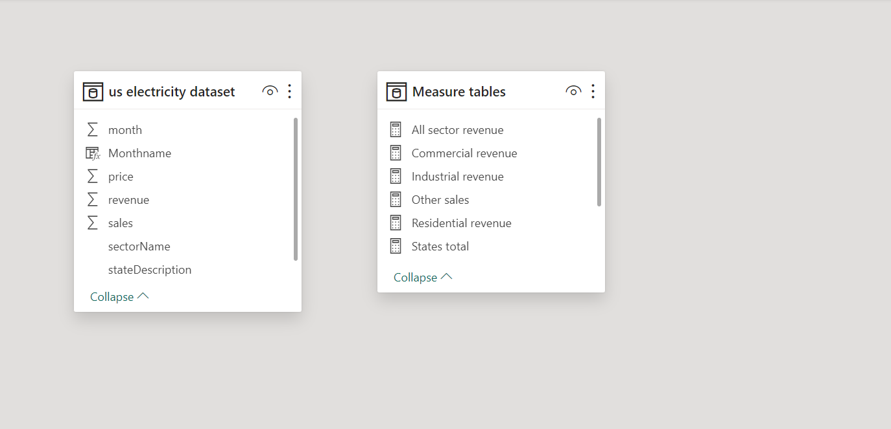
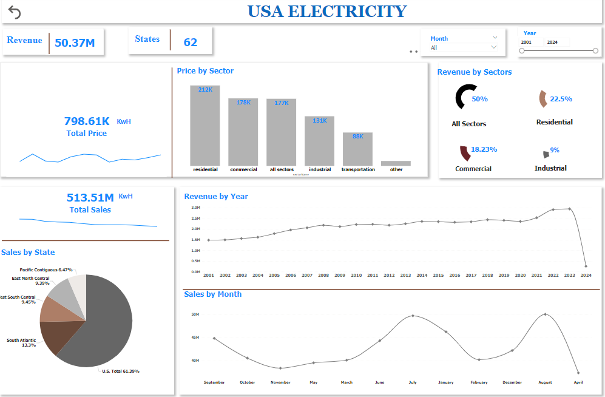

# USA Electricity Analysis

----

## Problem Statement
1. How much price did each sector make??
2. What was the percent of sales made by states?
3. What was the percent distribution of revenue amongst each sector?

## Data Source
The data was sourced from kaggle. Here the link to the dataset(https://drive.google.com/file/d/1AW7WQhdmsDHGKHW8trO-tj0PIyAjesGr/view?usp=sharing)

## Data Cleaning and DAX
The data was predominantely clean. Calculated column using SWITCH function was used to get the month name. Measures table was created to house the various measures were generated using CALCULATE, SUM functions.

## Data Modelling
The dataset only has one table and we also created a new table to house the measures.

---

## Data Visualization
The dashboard is a one pager. Here is the link to interact with the dashboard(https://app.powerbi.com/view?r=eyJrIjoiM2I1NDY2ZjktMWU4NC00ODhmLTkwYWUtNzFlMjJiOGU5NWQwIiwidCI6ImUyODE5OGNhLTExOWQtNDhmOC1iYzBlLTczMzIxYTM4YzJlMyJ9)

## Dashboard

---

## Insights
1. 2024 saw a deep in the revenue, mainly because not enough data was collated during that year.
2. There seems to be loads of fluctuations in the months regarding the sales.
3. All sectors recorded 50% of the total revenue, followed by the residential sector with 22.5%.

